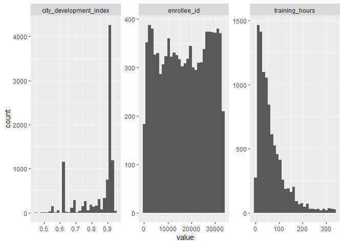
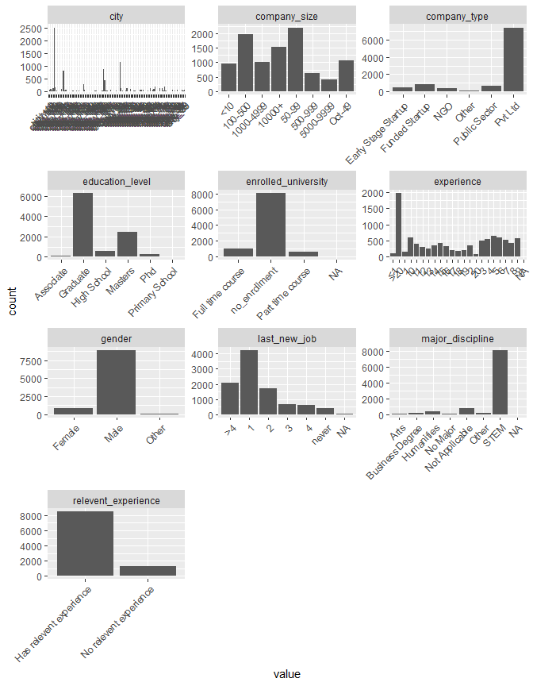

## Load libraries


```r
library(tidyverse)
library(tidymodels)
library(here)
library(janitor)
library(kableExtra)
```

## read data


```r
dt <- read_csv(here("data", "aug_train.csv"))
```

## EDA

### Initial look at the data

There are 13 predictors and 1 target variable. Total sample size is 19158.

```r
#predictors and outcome name
names(dt)
```

```
##  [1] "enrollee_id"            "city"                   "city_development_index"
##  [4] "gender"                 "relevent_experience"    "enrolled_university"   
##  [7] "education_level"        "major_discipline"       "experience"            
## [10] "company_size"           "company_type"           "last_new_job"          
## [13] "training_hours"         "target"
```

```r
dim(dt)
```

```
## [1] 19158    14
```


We have 3 numeric predictors and rest are categorical. Target is numeric as well. This will be converted to factor.


```r
#check data type
dt %>% map_df(~data.frame(class = class(.x)),
                    .id = "variable")
```

```
##                  variable     class
## 1             enrollee_id   numeric
## 2                    city character
## 3  city_development_index   numeric
## 4                  gender character
## 5     relevent_experience character
## 6     enrolled_university character
## 7         education_level character
## 8        major_discipline character
## 9              experience character
## 10           company_size character
## 11           company_type character
## 12           last_new_job character
## 13         training_hours   numeric
## 14                 target   numeric
```

```r
#convert outcome to factor
dt <- dt %>% mutate(target = factor(target))
```

Below we see that the outcome class is imbalanced. Majority class ***0*** is 75% of the outcome and minority class ***1*** is only 25%. We will need to use techniques like upsampling, downsampling or SMOTE.


```r
#frequency table
dt %>% janitor::tabyl(target) %>% 
  adorn_pct_formatting(digit=2) %>% 
  knitr::kable() %>% 
  kable_classic(full_width = F, html_font = "Cambria")
```

<table class=" lightable-classic" style="font-family: Cambria; width: auto !important; margin-left: auto; margin-right: auto;">
 <thead>
  <tr>
   <th style="text-align:left;"> target </th>
   <th style="text-align:right;"> n </th>
   <th style="text-align:left;"> percent </th>
  </tr>
 </thead>
<tbody>
  <tr>
   <td style="text-align:left;"> 0 </td>
   <td style="text-align:right;"> 14381 </td>
   <td style="text-align:left;"> 75.07% </td>
  </tr>
  <tr>
   <td style="text-align:left;"> 1 </td>
   <td style="text-align:right;"> 4777 </td>
   <td style="text-align:left;"> 24.93% </td>
  </tr>
</tbody>
</table>

### Checking missingness.

Data below shows the two outcome classes have different rate of missing predictors. Outcome class ***0*** is missing one or more predictors 48% of the times and outcome class ***1*** is missing one or more predictors 69% of the time.


```r
dt %>% 
  mutate(complete = complete.cases(.)) %>% 
  tabyl(target, complete) %>% 
  adorn_percentages() %>% 
  adorn_pct_formatting(digits = 2) %>% 
  adorn_ns() %>% 
  adorn_title() %>% 
  knitr::kable() %>% 
  kable_classic(full_width = F, html_font = "Cambria")
```

<table class=" lightable-classic" style="font-family: Cambria; width: auto !important; margin-left: auto; margin-right: auto;">
 <thead>
  <tr>
   <th style="text-align:left;">  </th>
   <th style="text-align:left;"> complete </th>
   <th style="text-align:left;">  </th>
  </tr>
 </thead>
<tbody>
  <tr>
   <td style="text-align:left;"> target </td>
   <td style="text-align:left;"> FALSE </td>
   <td style="text-align:left;"> TRUE </td>
  </tr>
  <tr>
   <td style="text-align:left;"> 0 </td>
   <td style="text-align:left;"> 48.04% (6909) </td>
   <td style="text-align:left;"> 51.96% (7472) </td>
  </tr>
  <tr>
   <td style="text-align:left;"> 1 </td>
   <td style="text-align:left;"> 68.96% (3294) </td>
   <td style="text-align:left;"> 31.04% (1483) </td>
  </tr>
</tbody>
</table>

We also see that there are some predictors that are missing quite a bit of data. ***Company_type*** and ***company_size*** are missing over 30% of data. Similarly, ***gender*** is missing close to 25% and ***major_discipline*** is missing \~15% of data.


```r
#check for null values
dt %>% map_df(
  ~tibble(
    total = sum(is.na(.x)),
    prop = 100*mean(is.na(.x))),
  .id = "variable") %>% arrange(desc(prop)) %>% 
  knitr::kable() %>% 
  kable_classic(full_width = F, html_font = "Cambria")
```

<table class=" lightable-classic" style="font-family: Cambria; width: auto !important; margin-left: auto; margin-right: auto;">
 <thead>
  <tr>
   <th style="text-align:left;"> variable </th>
   <th style="text-align:right;"> total </th>
   <th style="text-align:right;"> prop </th>
  </tr>
 </thead>
<tbody>
  <tr>
   <td style="text-align:left;"> company_type </td>
   <td style="text-align:right;"> 6140 </td>
   <td style="text-align:right;"> 32.0492745 </td>
  </tr>
  <tr>
   <td style="text-align:left;"> company_size </td>
   <td style="text-align:right;"> 5938 </td>
   <td style="text-align:right;"> 30.9948846 </td>
  </tr>
  <tr>
   <td style="text-align:left;"> gender </td>
   <td style="text-align:right;"> 4508 </td>
   <td style="text-align:right;"> 23.5306399 </td>
  </tr>
  <tr>
   <td style="text-align:left;"> major_discipline </td>
   <td style="text-align:right;"> 2813 </td>
   <td style="text-align:right;"> 14.6831611 </td>
  </tr>
  <tr>
   <td style="text-align:left;"> education_level </td>
   <td style="text-align:right;"> 460 </td>
   <td style="text-align:right;"> 2.4010857 </td>
  </tr>
  <tr>
   <td style="text-align:left;"> last_new_job </td>
   <td style="text-align:right;"> 423 </td>
   <td style="text-align:right;"> 2.2079549 </td>
  </tr>
  <tr>
   <td style="text-align:left;"> enrolled_university </td>
   <td style="text-align:right;"> 386 </td>
   <td style="text-align:right;"> 2.0148241 </td>
  </tr>
  <tr>
   <td style="text-align:left;"> experience </td>
   <td style="text-align:right;"> 65 </td>
   <td style="text-align:right;"> 0.3392839 </td>
  </tr>
  <tr>
   <td style="text-align:left;"> enrollee_id </td>
   <td style="text-align:right;"> 0 </td>
   <td style="text-align:right;"> 0.0000000 </td>
  </tr>
  <tr>
   <td style="text-align:left;"> city </td>
   <td style="text-align:right;"> 0 </td>
   <td style="text-align:right;"> 0.0000000 </td>
  </tr>
  <tr>
   <td style="text-align:left;"> city_development_index </td>
   <td style="text-align:right;"> 0 </td>
   <td style="text-align:right;"> 0.0000000 </td>
  </tr>
  <tr>
   <td style="text-align:left;"> relevent_experience </td>
   <td style="text-align:right;"> 0 </td>
   <td style="text-align:right;"> 0.0000000 </td>
  </tr>
  <tr>
   <td style="text-align:left;"> training_hours </td>
   <td style="text-align:right;"> 0 </td>
   <td style="text-align:right;"> 0.0000000 </td>
  </tr>
  <tr>
   <td style="text-align:left;"> target </td>
   <td style="text-align:right;"> 0 </td>
   <td style="text-align:right;"> 0.0000000 </td>
  </tr>
</tbody>
</table>

Furthermore, only \~46% of data is complete. \~54% of data is missing one or more predictor value.


```r
#For each rows, complete.cases returns TRUE only if no columns have missing value
100*sum(complete.cases(dt))/nrow(dt)
```

```
## [1] 46.74288
```

Looking at two predictors with most missing values, ***company_type*** and ***company_size***, we see that they tend to be missing together.

When ***company_type*** is missing, \~87% of the time ***company_size*** is missing as well. When ***company_size*** is missing, \~90% of the time ***company_type*** is missing as well.


```r
#
missing_together <- as_tibble(dt %>% is.na()) %>% 
  mutate(both_na = company_type+company_size) %>% 
  filter(both_na == 2) %>% 
  count()

# company_type is missing 6140 samples
100*missing_together/6140
```

```
##          n
## 1 87.29642
```

```r
#company_type is missing 5930 samples
100*missing_together/5938
```

```
##          n
## 1 90.26608
```

With such high percentage of data missing, we cannot impute missing values without perturbing the true underlying relationship between the predictors and the response. Samples with missing values for few top predictors(in terms of missing count) should be discarded. Given the size of our data this will still leave us with enough data.

Before dropping these samples, we will look at other predictors for any possible pattern.


```r
options(width = 90)

dt %>% tabyl(education_level, major_discipline) %>% 
  adorn_totals(where = "row") %>% 
  adorn_title() %>% 
  knitr::kable() %>% 
  kable_classic(full_width = F, html_font = "Cambria")
```

<table class=" lightable-classic" style="font-family: Cambria; width: auto !important; margin-left: auto; margin-right: auto;">
 <thead>
  <tr>
   <th style="text-align:left;">  </th>
   <th style="text-align:left;"> major_discipline </th>
   <th style="text-align:left;">  </th>
   <th style="text-align:left;">  </th>
   <th style="text-align:left;">  </th>
   <th style="text-align:left;">  </th>
   <th style="text-align:left;">  </th>
   <th style="text-align:left;">  </th>
  </tr>
 </thead>
<tbody>
  <tr>
   <td style="text-align:left;"> education_level </td>
   <td style="text-align:left;"> Arts </td>
   <td style="text-align:left;"> Business Degree </td>
   <td style="text-align:left;"> Humanities </td>
   <td style="text-align:left;"> No Major </td>
   <td style="text-align:left;"> Other </td>
   <td style="text-align:left;"> STEM </td>
   <td style="text-align:left;"> NA_ </td>
  </tr>
  <tr>
   <td style="text-align:left;"> Graduate </td>
   <td style="text-align:left;"> 208 </td>
   <td style="text-align:left;"> 238 </td>
   <td style="text-align:left;"> 420 </td>
   <td style="text-align:left;"> 194 </td>
   <td style="text-align:left;"> 272 </td>
   <td style="text-align:left;"> 10244 </td>
   <td style="text-align:left;"> 22 </td>
  </tr>
  <tr>
   <td style="text-align:left;"> High School </td>
   <td style="text-align:left;"> 0 </td>
   <td style="text-align:left;"> 0 </td>
   <td style="text-align:left;"> 0 </td>
   <td style="text-align:left;"> 0 </td>
   <td style="text-align:left;"> 0 </td>
   <td style="text-align:left;"> 0 </td>
   <td style="text-align:left;"> 2017 </td>
  </tr>
  <tr>
   <td style="text-align:left;"> Masters </td>
   <td style="text-align:left;"> 42 </td>
   <td style="text-align:left;"> 86 </td>
   <td style="text-align:left;"> 225 </td>
   <td style="text-align:left;"> 29 </td>
   <td style="text-align:left;"> 100 </td>
   <td style="text-align:left;"> 3873 </td>
   <td style="text-align:left;"> 6 </td>
  </tr>
  <tr>
   <td style="text-align:left;"> Phd </td>
   <td style="text-align:left;"> 3 </td>
   <td style="text-align:left;"> 3 </td>
   <td style="text-align:left;"> 24 </td>
   <td style="text-align:left;"> 0 </td>
   <td style="text-align:left;"> 9 </td>
   <td style="text-align:left;"> 375 </td>
   <td style="text-align:left;"> 0 </td>
  </tr>
  <tr>
   <td style="text-align:left;"> Primary School </td>
   <td style="text-align:left;"> 0 </td>
   <td style="text-align:left;"> 0 </td>
   <td style="text-align:left;"> 0 </td>
   <td style="text-align:left;"> 0 </td>
   <td style="text-align:left;"> 0 </td>
   <td style="text-align:left;"> 0 </td>
   <td style="text-align:left;"> 308 </td>
  </tr>
  <tr>
   <td style="text-align:left;"> NA </td>
   <td style="text-align:left;"> 0 </td>
   <td style="text-align:left;"> 0 </td>
   <td style="text-align:left;"> 0 </td>
   <td style="text-align:left;"> 0 </td>
   <td style="text-align:left;"> 0 </td>
   <td style="text-align:left;"> 0 </td>
   <td style="text-align:left;"> 460 </td>
  </tr>
  <tr>
   <td style="text-align:left;"> Total </td>
   <td style="text-align:left;"> 253 </td>
   <td style="text-align:left;"> 327 </td>
   <td style="text-align:left;"> 669 </td>
   <td style="text-align:left;"> 223 </td>
   <td style="text-align:left;"> 381 </td>
   <td style="text-align:left;"> 14492 </td>
   <td style="text-align:left;"> 2813 </td>
  </tr>
</tbody>
</table>

We see that predictor ***major_discipline*** is missing 2813 samples. When tabulating it against education level, we seen an interesting pattern.
Vast majority of missing ***major_discipline*** have education level *High School* and *Primary School*. This makes sense, since high school and primary school don't have major discipline. These missing values will be encoded as *Not Applicable*.
The frequency table also shows that 460 samples are missing both ***education_level*** and ***major_discipline***. Given that all other eductaion levels except community college are represented in the data and this group has missing major, it is reasonable to expect that this missing ***education_level*** is commuity college associate degree. This will be encoded as *Associate* and its ***major_discipline*** will be encoded as *Not Applicable*.


```r
dt_clean <- dt %>% 
  replace_na(list(education_level = "Associate"))

dt_clean <- dt_clean %>% 
  mutate(
    major_discipline = case_when(
      education_level %in% c("High School", "Primary School", "Associate") ~ "Not Applicable",
      TRUE ~ major_discipline
    )
         )
```


```r
dt_clean <- dt_clean %>% drop_na(company_size, company_type, gender)
```

After dropping missing values from 3 predictors with very high missing %, we are left with 9791 samples.


```r
#original data 
dim(dt)
```

```
## [1] 19158    14
```

```r
# after cleaning
dim(dt_clean)
```

```
## [1] 9791   14
```

Remaining missing values are shown below.

```r
#check for remaining null values
dt_clean %>% map_df(
  ~tibble(
    total = sum(is.na(.x)),
    prop = 100*mean(is.na(.x))),
  .id = "variable") %>% arrange(desc(prop)) %>% 
  knitr::kable() %>% 
  kable_classic(full_width = F, html_font = "Cambria")
```

<table class=" lightable-classic" style="font-family: Cambria; width: auto !important; margin-left: auto; margin-right: auto;">
 <thead>
  <tr>
   <th style="text-align:left;"> variable </th>
   <th style="text-align:right;"> total </th>
   <th style="text-align:right;"> prop </th>
  </tr>
 </thead>
<tbody>
  <tr>
   <td style="text-align:left;"> enrolled_university </td>
   <td style="text-align:right;"> 72 </td>
   <td style="text-align:right;"> 0.7353692 </td>
  </tr>
  <tr>
   <td style="text-align:left;"> last_new_job </td>
   <td style="text-align:right;"> 27 </td>
   <td style="text-align:right;"> 0.2757635 </td>
  </tr>
  <tr>
   <td style="text-align:left;"> major_discipline </td>
   <td style="text-align:right;"> 8 </td>
   <td style="text-align:right;"> 0.0817077 </td>
  </tr>
  <tr>
   <td style="text-align:left;"> experience </td>
   <td style="text-align:right;"> 6 </td>
   <td style="text-align:right;"> 0.0612808 </td>
  </tr>
  <tr>
   <td style="text-align:left;"> enrollee_id </td>
   <td style="text-align:right;"> 0 </td>
   <td style="text-align:right;"> 0.0000000 </td>
  </tr>
  <tr>
   <td style="text-align:left;"> city </td>
   <td style="text-align:right;"> 0 </td>
   <td style="text-align:right;"> 0.0000000 </td>
  </tr>
  <tr>
   <td style="text-align:left;"> city_development_index </td>
   <td style="text-align:right;"> 0 </td>
   <td style="text-align:right;"> 0.0000000 </td>
  </tr>
  <tr>
   <td style="text-align:left;"> gender </td>
   <td style="text-align:right;"> 0 </td>
   <td style="text-align:right;"> 0.0000000 </td>
  </tr>
  <tr>
   <td style="text-align:left;"> relevent_experience </td>
   <td style="text-align:right;"> 0 </td>
   <td style="text-align:right;"> 0.0000000 </td>
  </tr>
  <tr>
   <td style="text-align:left;"> education_level </td>
   <td style="text-align:right;"> 0 </td>
   <td style="text-align:right;"> 0.0000000 </td>
  </tr>
  <tr>
   <td style="text-align:left;"> company_size </td>
   <td style="text-align:right;"> 0 </td>
   <td style="text-align:right;"> 0.0000000 </td>
  </tr>
  <tr>
   <td style="text-align:left;"> company_type </td>
   <td style="text-align:right;"> 0 </td>
   <td style="text-align:right;"> 0.0000000 </td>
  </tr>
  <tr>
   <td style="text-align:left;"> training_hours </td>
   <td style="text-align:right;"> 0 </td>
   <td style="text-align:right;"> 0.0000000 </td>
  </tr>
  <tr>
   <td style="text-align:left;"> target </td>
   <td style="text-align:right;"> 0 </td>
   <td style="text-align:right;"> 0.0000000 </td>
  </tr>
</tbody>
</table>

Now, the missing predictors for both outcome classes is much closer.


```r
dt_clean %>% 
  mutate(complete = complete.cases(.)) %>% 
  tabyl(target, complete) %>% 
  adorn_percentages() %>% 
  adorn_pct_formatting() %>% 
  adorn_ns() %>% 
  adorn_title() %>% 
  knitr::kable() %>% 
  kable_classic(full_width = F, html_font = "Cambria")
```

<table class=" lightable-classic" style="font-family: Cambria; width: auto !important; margin-left: auto; margin-right: auto;">
 <thead>
  <tr>
   <th style="text-align:left;">  </th>
   <th style="text-align:left;"> complete </th>
   <th style="text-align:left;">  </th>
  </tr>
 </thead>
<tbody>
  <tr>
   <td style="text-align:left;"> target </td>
   <td style="text-align:left;"> FALSE </td>
   <td style="text-align:left;"> TRUE </td>
  </tr>
  <tr>
   <td style="text-align:left;"> 0 </td>
   <td style="text-align:left;"> 1.0% (80) </td>
   <td style="text-align:left;"> 99.0% (8118) </td>
  </tr>
  <tr>
   <td style="text-align:left;"> 1 </td>
   <td style="text-align:left;"> 1.9% (30) </td>
   <td style="text-align:left;"> 98.1% (1563) </td>
  </tr>
</tbody>
</table>

But as a result of dropping the missing samples, out final data has become more imbalanced.


```r
janitor::tabyl(dt_clean$target) %>% 
  adorn_pct_formatting() %>% 
  knitr::kable() %>% 
  kable_classic(full_width = F, html_font = "Cambria")
```

<table class=" lightable-classic" style="font-family: Cambria; width: auto !important; margin-left: auto; margin-right: auto;">
 <thead>
  <tr>
   <th style="text-align:left;"> dt_clean$target </th>
   <th style="text-align:right;"> n </th>
   <th style="text-align:left;"> percent </th>
  </tr>
 </thead>
<tbody>
  <tr>
   <td style="text-align:left;"> 0 </td>
   <td style="text-align:right;"> 8198 </td>
   <td style="text-align:left;"> 83.7% </td>
  </tr>
  <tr>
   <td style="text-align:left;"> 1 </td>
   <td style="text-align:right;"> 1593 </td>
   <td style="text-align:left;"> 16.3% </td>
  </tr>
</tbody>
</table>

# Predictor distribution

As seen from histogram below, predictors ***city_development_index*** and ***training_hours*** are skewed. They will need transformation to make them more symmetrical. 
***enrollee_id*** is has very high cardinality and carries no information for model to learn from. This variable will not be fed to the model but will be carried along for model diagnosis.

```r
## Numeric 
dt_clean %>% 
  select(where(is.numeric)) %>% 
  pivot_longer(everything()) %>% 
  ggplot(aes(value))+
  geom_histogram()+
  facet_wrap(.~name, scales = "free") 
```

<!-- -->

Bar plots of categorial predictors show show many predictors with imbalanced levels. ***major_discipline*** predictor has almost 8000 samples as STEM out of total 9791 samples. There is similar imbalance in ***gender***, ***relevant_experience***, ***company_type*** and few other predictors.
We should handle this by either removing near zero variance (nzv) predictors or lumping the less frequent levels into one single level

```r
# Character  

dt_clean %>% 
  select(where(is.character)) %>% 
  pivot_longer(everything()) %>% 
  group_by(name, value) %>% summarize(count = n()) %>% 
  ggplot(aes(tidytext::reorder_within(value,count, name), count))+
  geom_col()+
  facet_wrap(.~name, scales = "free",ncol = 3)+
  theme(axis.text.x=element_text(angle = 45, hjust=1))
```



We also notice that ***city*** predictor has 117 different levels. But most of those levels occur less frequently. Those low frequency levels should be grouped into one level.

```r
dt_clean %>% distinct(city) %>% count()
```

```
## # A tibble: 1 x 1
##       n
##   <int>
## 1   117
```

```r
dt_clean %>% tabyl(city) %>% head()
```

```
##      city    n     percent
##    city_1   15 0.001532019
##   city_10   58 0.005923808
##  city_100  111 0.011336942
##  city_101   29 0.002961904
##  city_102  140 0.014298846
##  city_103 2514 0.256766418
```

# TO DO

# Data split 

```r
initial_split <- initial_split(dt_clean)
dt_train <- training(initial_split)
dt_test <- testing(initial_split)

folds <- vfold_cv(dt_train, v = 10, strata = target)
```


```r
rcp <- recipe(target ~., data = dt_train) %>% 
  update_role(enrollee_id, new_role = "id") %>% 
  step_YeoJohnson(all_numeric(), -target) %>% 
  step_normalize(all_numeric(), -target) %>% 
  step_other(all_nominal(), threshold = 0.1)
```


# Preprocessing -----------------------------------------------------------


# Model -------------------------------------------------------------------

rf <- rand_forest(mode = "classification", )


```


```r
df <- tibble(x = c(1, 2, NA), y = c("a", NA, "b"))
df %>% drop_na(x,y)
```

```
## # A tibble: 1 x 2
##       x y    
##   <dbl> <chr>
## 1     1 a
```

```r
df %>% {sum(is.na(.$x))}
```

```
## [1] 1
```

```r
df %>% mutate(complete= complete.cases(.))
```

```
## # A tibble: 3 x 3
##       x y     complete
##   <dbl> <chr> <lgl>   
## 1     1 a     TRUE    
## 2     2 <NA>  FALSE   
## 3    NA b     FALSE
```
